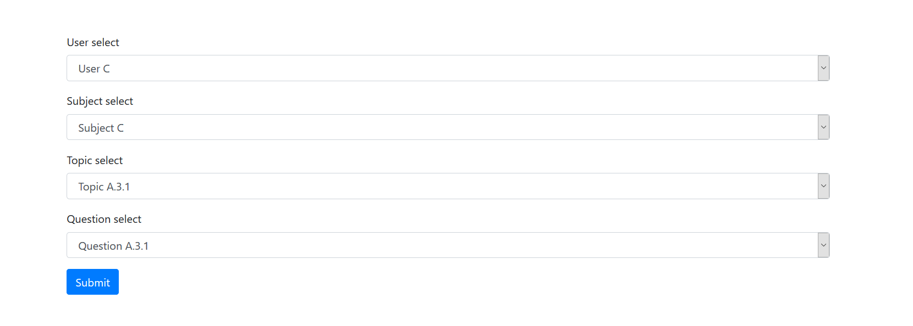

# Dependent-list-with-jQuery
This is simple dependent list with jQuery. Basically I was used it to work with database. I have got the data from database to create the lists. 



# HTML 
In HTML we will use `data-list-id` attribute with child list to make the list depend on parent list. 
Like, `data-list-id` contains the value of parent list.

```HTML
<form>
        <!-- Super Parent -->
        <div class="form-group">
            <label for="first_list"> User select </label>
            <select class="form-control" id="first_list">
              <option value="0"> Select User list </option>
              <option value="1"> User A </option>
              <option value="2"> User B </option>
              <option selected value="3"> User C </option>
              <option value="4"> User D </option>
              <option value="5"> User E </option>
            </select>
        </div>

        <!-- Parent: User list and Child: Subject list -->
        <div class="form-group">
            <label for="second_list"> Subject select </label>
            <select class="form-control" id="second_list">
              <option data-list-id="0" value="0"> Select subject list </option>
              <option data-list-id="1" value="1"> Subject A.1 </option>
              <option data-list-id="1" value="2"> Subject A.2 </option>
              <option data-list-id="1" value="3"> Subject A.3 </option>
              <option data-list-id="2" value="4"> Subject B </option>
              <option data-list-id="3" selected value="5"> Subject C </option>
              <option data-list-id="4" value="6"> Subject D </option>
              <option data-list-id="5" value="7"> Subject E </option>
            </select>
          </div>

          <!-- Parent: Subject list and Child: Topic list -->
          <div class="form-group">
            <label for="third_list">Topic select</label>
            <select class="form-control" id="third_list">
                <option data-list-id="0" value="0"> Select Topic list </option>
              <option data-list-id="1" value="1"> Topic A.1.1 </option>
              <option data-list-id="1" value="2"> Topic A.1.2 </option>
              <option data-list-id="1" value="3"> Topic A.1.3 </option>
              <option data-list-id="2" value="4"> Topic A.2.1 </option>
              <option data-list-id="3" selected value="5"> Topic A.3.1 </option>
              <option data-list-id="4" value="6"> Topic B </option>
              <option data-list-id="5" value="7"> Topic C </option>
              <option data-list-id="6" value="8"> Topic D </option>
              <option data-list-id="7" value="9"> Topic E </option>
            </select>
          </div>

          <!-- Parent: Subject list and Child: Question list -->
          <div class="form-group">
            <label for="fourth_list">Question select</label>
            <select class="form-control" id="fourth_list">
                <option data-list-id="0" value="0"> Select Question list </option>
                <option data-list-id="1" value="1"> Question A.1.1 </option>
              <option data-list-id="1" value="2"> Question A.1.2 </option>
              <option data-list-id="1" value="3"> Question A.1.3 </option>
              <option data-list-id="2" value="4"> Question A.2.1 </option>
              <option data-list-id="3" selected value="5"> Question A.3.1 </option>
              <option data-list-id="4" value="6"> Question B </option>
              <option data-list-id="5" value="7"> Question C </option>
              <option data-list-id="6" value="8"> Question D </option>
              <option data-list-id="7" value="9"> Question E </option>
            </select>
          </div>

        <button type="submit" class="btn btn-primary">Submit</button>
    </form>
```

# jQuery snippet file
Add this script file or direct use following snippet.

```JavaScript
function createDependableList(parentList, childList) {
    var options = $(childList+' option');

    $(parentList).change( function() {
        $(childList).empty();
       
        options.each((index, option)=> {

            if ( $(option).data('list-id') == this.value /* || $(option).data('list-id') == 0 */ ) {
                option.selected = option.selected ? true : false;
                
                $(childList).append(option);
            }  

            $(childList).trigger('change');
        })

        if ( $(childList+' option').length === 0 ) {
            $(childList).append('<option value="">No option available..</option>');
        }

    })
}
```

# Use this snippet

```JavaScript
<script type="text/javascript">
  createDependableList ( '#first_list', '#second_list' );
  createDependableList ( '#second_list', '#third_list' );
  createDependableList ( '#second_list', '#fourth_list' );
</script>
```
